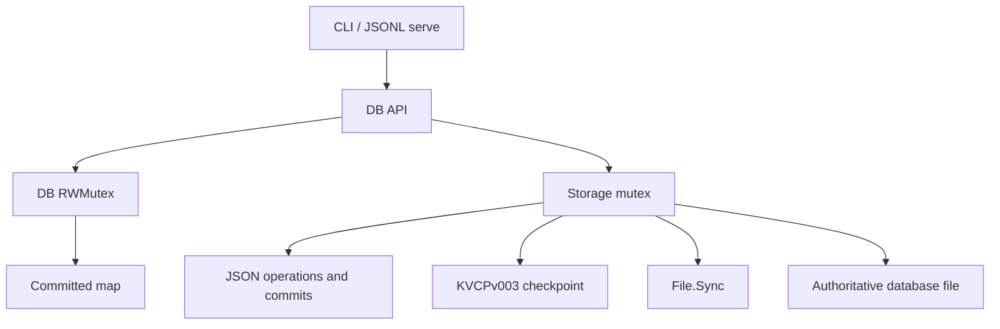
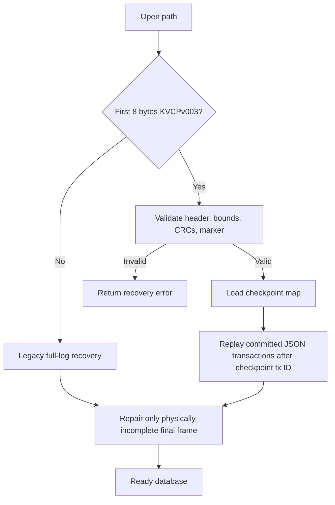
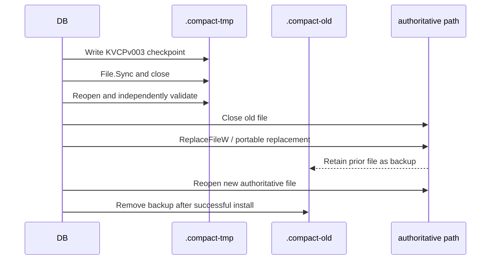

# Architecture diagrams

## Runtime and storage

```mermaid
flowchart TD
    CLI[CLI / JSONL serve] --> DB[DB API]
    DB --> Lock[DB RWMutex]
    Lock --> Index[Committed map]
    DB --> Storage[Storage mutex]
    Storage --> Records[JSON operations and commits]
    Storage --> Checkpoint[KVCPv003 checkpoint]
    Storage --> Sync[File.Sync]
    Storage --> File[Authoritative database file]
```

## Checkpoint recovery

```mermaid
flowchart TD
    Open[Open path] --> Magic{First 8 bytes KVCPv003?}
    Magic -- No --> Legacy[Legacy full-log recovery]
    Magic -- Yes --> Validate[Validate header, bounds, CRCs, marker]
    Validate -- Invalid --> Fail[Return recovery error]
    Validate -- Valid --> Load[Load checkpoint map]
    Load --> Replay[Replay committed JSON transactions after checkpoint tx ID]
    Legacy --> Tail[Repair only physically incomplete final frame]
    Replay --> Tail
    Tail --> Ready[Ready database]
```

## Compaction replacement

```mermaid
sequenceDiagram
    participant DB
    participant TMP as .compact-tmp
    participant OLD as .compact-old
    participant BASE as authoritative path
    DB->>TMP: Write KVCPv003 checkpoint
    DB->>TMP: File.Sync and close
    DB->>TMP: Reopen and independently validate
    DB->>BASE: Close old file
    DB->>BASE: ReplaceFileW / portable replacement
    BASE-->>OLD: Retain prior file as backup
    DB->>BASE: Reopen new authoritative file
    DB->>OLD: Remove backup after successful install
```
